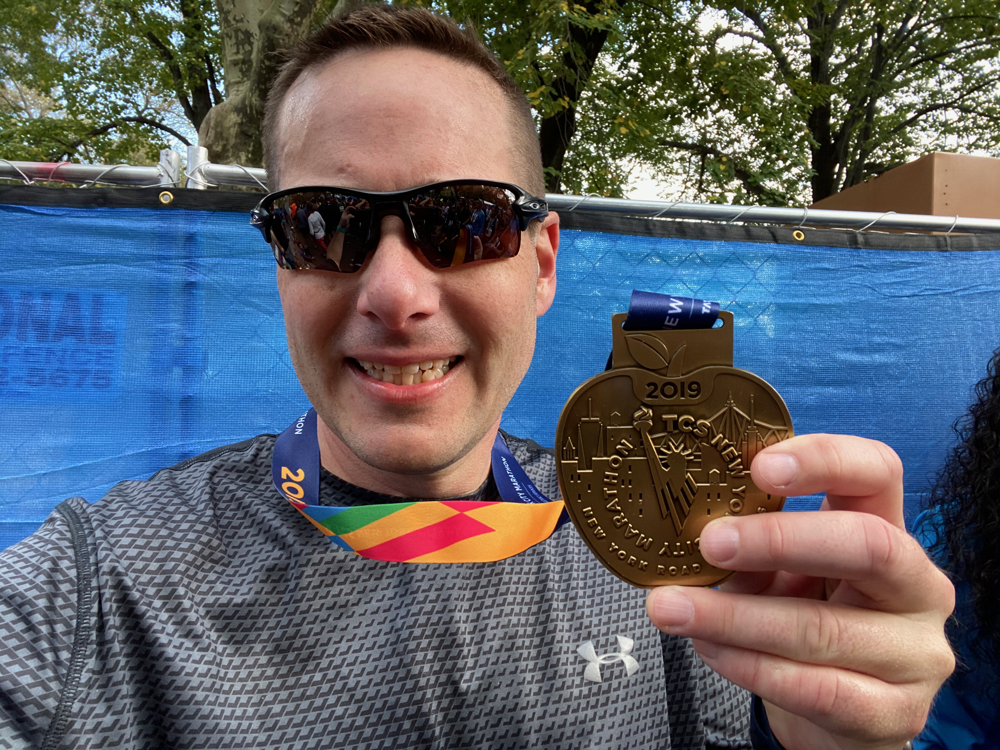

<div class="notes">
Documentation on using ioslides is available here:
http://rmarkdown.rstudio.com/ioslides_presentation_format.html
Some slides are adopted (or copied) from OpenIntro: https://www.openintro.org/
</div>


## Agenda

* Introduction
	* Syllabus
	* Assignments
		* Homework
		* Labs
		* Data Project
		* Final exam
		* Meetup Presentation
	* The `DATA606` R Package
	* Using R Markdown


## Introduction

A little about me:

* Assistant Professor at CUNY in Data Science and Information Systems
* Principal Investigator for a Department of Education Grant (part of their FIPSE First in the World program) to develop a Diagnostic Assessment and Achievement of College Skills ([www.DAACS.net](http://www.daacs.net))  
* Authored over a dozen R packages including:
	* [likert](http://github.com/jbryer/likert)
	* [sqlutils](http://github.com/jbryer/sqlutils)
	* [timeline](http://github.com/jbryer/timeline)
* Specialize in propensity score methods. Three new methods/R packages developed include:
	* [multilevelPSA](http://github.com/jbryer/multilevelPSA)
	* [TriMatch](http://github.com/jbryer/TriMatch)
	* [PSAboot](http://github.com/jbryer/PSAboot)

## Also a Father...

<center></center>

## Runner...

<table border='0' width='100%'><tr><td>
<center></center>
</td><td>
<center></center>
</td></tr></table>

## And photographer.

<center></center>

## Syllabus

Syllabus and course materials are here: [https://fall2020.data606.net](https://fall2020.data606.net)

The site is built using the [Blogdown](https://bookdown.org/yihui/blogdown/) R package and hosted on [Github](https://github.com/jbryer/DATA606Fall2020). Each page of the site has a "Improve this page" link at the bottom right, use that to start a pull request on Github.

We will use Blackboard primary only for submitting assignments. Please submit:

* A PDF or link to the built HTML (e.g. Rpubs, [Github](http://htmlpreview.github.io/))

PDFs are preferred for the homework as there is some LaTeX formatting in the R markdown files. The `tineytex` R package helps with install LaTeX, but you can also install LaTeX using ([MiKTeX](http://miktex.org) (for Windows) and [BasicTeX](http://www.tug.org/mactex/morepackages.html) (for Mac) See this page for more information: 
https://fall2020.data606.net/course-overview/software/

## Meetups

We will have meetups on Wednesday evenings at 8:30pm. 

Meetups will be recorded and made available the next day on the [course website](https://fall2020.data606.net/course-overview/meetups/).

Though attendance is not strictly required, I expect everyone to watch them at during the week. I use the meetups to convey important information and announcements. Students who attend the meetups tend to do well on the assignments.

**Please note:** *Students who participate in this class with their camera on or use a profile image are agreeing to have their video or image recorded solely for the purpose of creating a record for students enrolled in the class to refer to, including those enrolled students who are unable to attend live.  If you are unwilling to consent to have your profile or video image recorded, be sure to keep your camera off and do not use a profile image. Likewise, students who un-mute during class and participate orally are agreeing to have their voices recorded.  If you are not willing to consent to have your voice recorded during class, you will need to keep your mute button activated and communicate exclusively using the "chat" feature, which allows students to type questions and comments live.*


##  {.smaller}

```{r schedule-setup, echo=FALSE, warning=FALSE, message=FALSE}
# devtools::install_github("gadenbuie/ggweekly")
library(ggweekly)
library(rlang) # Needed for the ggweekly.R script to work
library(configr)
library(ggplot2)
library(readxl)
library(lubridate)
# library(kableExtra)

options(knitr.kable.NA = '')

semester <- 'Fall 2020'

palette <- c('#8dd3c7','#ffffb3','#bebada','#fb8072','#80b1d3','#fdb462',
			 '#b3de69','#fccde5','#d9d9d9','#bc80bd','#ccebc5','#ffed6f')

lastModified <- format(file.info('../Schedule.xlsx')[1,]$mtime, '%B %d, %Y %I:%M%p')

meetups <- read_excel('../Schedule.xlsx', sheet = 'Meetups')
meetups$day <- as.Date(meetups$Date)
meetups$label <- paste0('Meetup ', meetups$StartTime, '\n', meetups$Topic)
# meetups$label <- meetups$Topic
meetups$color <- '#4A235A'
meetups$fill <- NA

officeHours <- read_excel('../Schedule.xlsx', sheet = 'Office_Hours')
officeHours$day <- as.Date(officeHours$Date)
officeHours$label <- paste0('Office Hours\n', officeHours$StartTime, '')
officeHours$color <- '#145A32'
officeHours$fill <- NA

schedule <- rbind(meetups[,c('day', 'label', 'color', 'fill')],
				  officeHours[,c('day', 'label', 'color', 'fill')])

topics <- read_excel('../Schedule.xlsx', sheet = 'Schedule')
topics$Start <- as.Date(topics$Start)
topics$End <- as.Date(topics$End)
for(i in 1:nrow(topics)) {
	schedule <- rbind(schedule, data.frame(
		day = topics[i,]$Start,
		label = paste0(topics[i,]$Topic, '\n\n\n'),
		color = '#000000',
		fill = palette[i]
	))
	dates <- seq(topics[i,]$Start, topics[i,]$End, by = 'day')[-1]
	for(j in seq_along(dates)) {
		schedule <- rbind(schedule, data.frame(
			day = dates[j],
			label = NA,
			color = NA,
			fill = palette[i]
		))
	}
}

start_day <- lubridate::floor_date(min(meetups$day), "month")
end_day <- lubridate::ceiling_date(max(meetups$day), "month") - 1
```

```{r printTopics, echo=FALSE, warning=FALSE, message=FALSE, results='asis'}
topics$Start <- format(topics$Start, format = '%A, %B %d, %Y')
topics$End <- format(topics$End, format = '%A, %B %d, %Y')
knitr::kable(topics)
```

## Assignments

* [DAACS](https://fall2020.data606.net/assignments/daacs) (5%)
* [Homework](https://fall2020.data606.net/assignments/homework) (20%)
* [Labs](https://fall2020.data606.net/assignments/labs) (40%)
	* Labs are designed to introduce to you doing statistics with R.
	* Answer the questions in the main text as well as the "On Your Own" section.
* [Data Project](https://fall2020.data606.net/assignments/project) (15%)
	* This allows you to analyze a dataset of your choosing. Projects will be shared with the class. This provides an opportunity for everyone to see different approaches to analyzing different datasets.
	* Proposal is due October 25th (5%); Final project is due December 9th (15%).
* [Final exam](https://fall2020.data606.net/assignments/final/) (15%)
* [Meetup Presentation](https://fall2020.data606.net/assignments/presentation) (5%)
	* Present one practice problem during our weekly meetups. Signup using the [Google Spreadsheet](https://fall2020.data606.net/course-overview/meetups).
	* **Please select odd number questions only!**


## Communication

* Slack Channel: https://data606fall2020.slack.com
	* [Click here to join the group](https://join.slack.com/t/data606fall2020/shared_invite/zt-gwto1eyo-r8tQGf_0V77AW4ey6rZKyA)
* There is a general CUNY MSDS Slack channel [click here](https://join.slack.com/t/data606fall2020/shared_invite/zt-gwto1eyo-r8tQGf_0V77AW4ey6rZKyA) to join it.
* Github Issues - Use this for issues or problems with the course or `DATA606` package: https://github.com/jbryer/DATA606Fall2020/issues
* Email: jason.bryer@sps.cuny.edu
* Phone/GoToMeeting: Please email to schedule a time to meet.
* Office hours will typically be:
	* Mondays from 8:30pm to 9:30pm
	* Fridays from 11:00am to 12:00pm
	* Please use the Calendly link on the course homepage.
	* I will use the same Zoom link that we use for the Wednesday night meetups.


## The `DATA606` R Package

The package can be installed from Github using the `devtools` package.

```{r, eval=FALSE}
devtools::install_github('jbryer/DATA606')
```

Download the `Setup.R` script here: https://github.com/jbryer/DATA606Fall2020/blob/master/R/Setup.R

### Important Functions

* `library('DATA606')` - Load the package
* `vignette(package='DATA606')` - Lists vignettes in the DATA606 package
* `vignette('os4')` - Loads a PDF of the OpenIntro Statistics book
* `data(package='DATA606')` - Lists data available in the package
* `getLabs()` - Returns a list of the available labs
* `viewLab('Lab1')` - Opens Lab1 in the default web browser
* `startLab('Lab1')` - Starts Lab1 (copies to getwd()), opens the Rmd file
* `shiny_demo()` - Lists available Shiny apps

## Using R Markdown

R Markdown files are provided for all the labs and homework.

* You can download R markdown template files for the homework by right clicking and selecting "Save file as..." from the [Homework](http://data606.net/assignments/homework/) page.
* You can start a lab using the `DATA606::startLab` function.

However, creating new R Markdown files in RStudio can be done by clicking `File` > `New File` > `R Markdown`.

For more information about R Markdown, check out the RStudio page at https://rmarkdown.rstudio.com/
