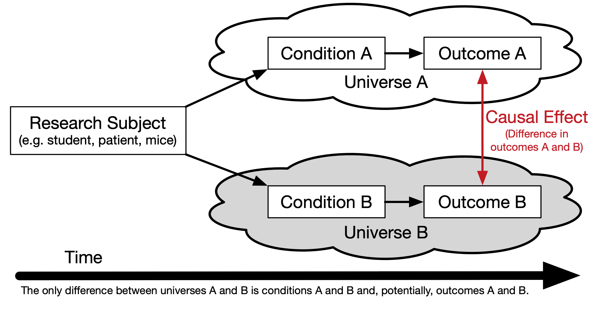

<div class="notes">
Documentation on using ioslides is available here:
http://rmarkdown.rstudio.com/ioslides_presentation_format.html
Some slides are adopted (or copied) from OpenIntro: https://www.openintro.org/
</div>

```{r setup, echo=FALSE, results='hide'}
# devtools::install_github("thomasp85/patchwork")
```


## Sampling vs. Census

A census involves collecting data for the entire population of interest. This is problematic for several reasons, including:

* It can be difficult to complete a census: there always seem to be some individuals who are hard to locate or hard to measure. And these difficult-to-find people may have certain characteristics that distinguish them from the rest of the population.
* Populations rarely stand still. Even if you could take a census, the population changes constantly, so it’s never possible to get a perfect measure.
* Taking a census may be more complex than sampling.

Sampling involves measuring a subset of the population of interest, usually randomly.

## Sampling Bias

* **Non-response**: If only a small fraction of the randomly sampled people choose to respond to a survey, the sample may no longer be representative of the population.
* **Voluntary response**: Occurs when the sample consists of people who volunteer to respond because they have strong opinions on the issue. Such a sample will also not be representative of the population.
* **Convenience sample**: Individuals who are easily accessible are more likely to be included in the sample.


## Observational Studies vs. Experiments

* **Observational study**: Researchers collect data in a way that does not directly interfere with how the data arise, i.e. they merely “observe”, and can only establish an association between the explanatory and response variables.
* **Experiment**: Researchers randomly assign subjects to various treatments in order to establish causal connections between the explanatory and response variables.

<center><br /><font size='-2'>Source: [XKCD 552 http://xkcd.com/552/](http://xkcd.com/552/)</font></center>

<br />

<center><b><font size="+4">Correlation does not imply causation!</font></b></center>

## Simple Random Sampling {.flexbox .vcenter}

Randomly select cases from the population, where there is no implied connection between the points that are selected.


## Stratified Sampling {.flexbox .vcenter}

*Strata* are made up of similar observations. We take a simple random sample from each stratum.


## Cluster Sampling {.flexbox .vcenter}

*Clusters* are usually not made up of homogeneous observations so we take random samples from random samples of clusters.


## Principles of experimental design

1. **Control**: Compare treatment of interest to a control group.
2. **Randomize**: Randomly assign subjects to treatments, and
randomly sample from the population whenever possible.
3. **Replicate**: Within a study, replicate by collecting a sufficiently large sample. Or replicate the entire study.
4. **Block**: If there are variables that are known or suspected to affect the response variable, first group subjects into blocks based on these variables, and then randomize cases within each block to treatment groups.

Difference between blocking and explanatory variables

* Factors are conditions we can impose on the experimental units.
* Blocking variables are characteristics that the experimental units come with, that we would like to control for.
* Blocking is like stratifying, except used in experimental settings when randomly assigning, as opposed to when sampling.

## More experimental design terminology...

* **Placebo**: fake treatment, often used as the control group for medical studies
* **Placebo effect**: experimental units showing improvement simply because they believe they are receiving a special treatment
* **Blinding**: when experimental units do not know whether they are in the control or treatment group
* **Double-blind**: when both the experimental units and the researchers who interact with the patients do not know who is in the control and who is in the treatment group

## Random assignment vs. random sampling {.flexbox .vcenter}


## Causality {.flexbox .vcenter}



## Randomized Control Trials {.flexbox .vcenter}

```{r echo=FALSE, message=FALSE, warning=FALSE}
library(ggplot2)
library(psych)
library(gridExtra)

library(patchwork)
library(purrr)
library(dplyr)

pop.mean <- 100
pop.sd <- 15
pop.es <- .3

n <- 30

set.seed(123)
thedata <- data.frame(
	id = 1:30,
	center = rnorm(n, mean = pop.mean, sd = pop.sd),
	stringsAsFactors = FALSE
)
val <- pop.sd * pop.es / 2
thedata$placebo <- thedata$center - val
thedata$treatment <- thedata$center + val
thedata$diff <- thedata$treatment - thedata$placebo
thedata$RCT_Assignment <- sample(c('placebo', 'treatment'), n, replace = TRUE)
thedata$RCT_Value <- as.numeric(apply(thedata, 1, 
					FUN = function(x) { return(x[x['RCT_Assignment']]) }))
tab.out <- describeBy(thedata$RCT_Value, group = thedata$RCT_Assignment, mat = TRUE, skew = FALSE)

p1 <- ggplot(thedata) + 
	geom_segment(aes(x = placebo, xend = treatment, y = id, yend = id)) +
	geom_point(aes(x = placebo, y = id), color = 'blue') +
	geom_point(aes(x = treatment, y = id), color = 'red') +
	ylab('') + xlab('Outcome') +
	xlim(pop.mean - 3 * pop.sd, pop.mean + 3 * pop.sd) +
	ggtitle(paste0('True Counterfactual Difference = ', mean(thedata$diff)))
p2 <- ggplot(thedata, aes(x = RCT_Value, color = RCT_Assignment, y = id)) +
	geom_point() +
	scale_color_manual(values = c('placebo' = 'blue', 'treatment' = 'red')) +
	theme(legend.position = 'none') +
	geom_vline(data = tab.out, aes(xintercept = mean, color = group1)) +
	ylab('') + xlab('Outcome') +
	xlim(pop.mean - 3 * pop.sd, pop.mean + 3 * pop.sd) +
	ggtitle(paste0('RCT Difference = ', round(diff(tab.out$mean), digits = 2)))
grid.arrange(p1, p2, nrow = 1)
```


