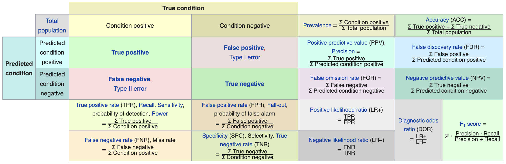

	
<div class="notes">
Documentation on using ioslides is available here:
http://rmarkdown.rstudio.com/ioslides_presentation_format.html
Some slides are adopted (or copied) from OpenIntro: https://www.openintro.org/
</div>

```{r setup, echo=FALSE, results='hide', warning=FALSE, message=FALSE}
knitr::opts_chunk$set(fig.align = 'center', fig.width = 9, 
					  message = FALSE, warning = FALSE, error = FALSE)
set.seed(2112)
library(ggplot2)
library(openintro)
library(DATA606)
library(reshape2)
library(psych)
library(reshape2)
library(xtable)
library(tidyverse)
options(width=100)
par(mar=c(2.5,1,2,1))

printLaTeXFormula <- function(fit, digits=2) {
	vars <- all.vars(fit$terms)
	result <- paste0('\\hat{', vars[1], '} = ', prettyNum(fit$coefficients[[1]], digits=2))
	for(i in 2:length(vars)) {
		val <- fit$coefficients[[i]]
		result <- paste0(result, ifelse(val < 0, ' - ', ' + '),
						 prettyNum(abs(val), digits=digits),
						 ' ', names(fit$coefficients)[i])
	}
	return(result)
}

source('../R/roc.R')
library(titanic)
data("titanic")

```

## Announcements

* No class next week - Happy Thanksgiving!
* Please complete the course evaluation if you have not done so already.
* Many of you have not yet signed up for a presentation time. The first one is in two weeks! [Click here](https://docs.google.com/spreadsheets/d/1LeIT87c7iTOGmJvZ4z8eyOOP530h3LLYBCJjxAxThLY/edit#gid=0) to sign up for a time slot to present.


## Relationship between dichotomous (x) and continuous (y) variables

```{r}
df <- data.frame(
	x = rep(c(0, 1), each = 10),
	y = c(rnorm(10, mean = 1, sd = 1),
		  rnorm(10, mean = 2.5, sd = 1.5))
)
head(df)
tab <- describeBy(df$y, group = df$x, mat = TRUE, skew = FALSE)
tab$group1 <- as.integer(as.character(tab$group1))
```

## Relationship between dichotomous (x) and continuous (y) variables

```{r, fig.height=4}
ggplot(df, aes(x = x, y = y)) +	geom_point(alpha = 0.5) +
	geom_point(data = tab, aes(x = group1, y = mean), color = 'red', size = 4) + 
	geom_smooth(method = lm, se = FALSE, formula = y ~ x)
```


## Regression so far...

At this point we have covered: 

* Simple linear regression
	* Relationship between numerical response and a numerical or categorical predictor
* Multiple regression
	* Relationship between numerical response and multiple numerical and/or categorical predictors

What we haven't seen is what to do when the predictors are weird (nonlinear, complicated dependence structure, etc.) or when the response is weird (categorical, count data, etc.)

## Odds

Odds are another way of quantifying the probability of an event, commonly used in gambling (and logistic regression).

Odds

For some event $E$,

\[\text{odds}(E) = \frac{P(E)}{P(E^c)} = \frac{P(E)}{1-P(E)}\]

Similarly, if we are told the odds of E are $x$ to $y$ then

\[\text{odds}(E) = \frac{x}{y} = \frac{x/(x+y)}{y/(x+y)} \]

which implies

\[P(E) = x/(x+y),\quad P(E^c) = y/(x+y)\]

## Generalized Linear Models

Generalized linear models (GLM) is a generalization of OLS that allows for the response variables (i.e. dependent variables) to have an error distribution that is not normally distributed. Logistic regression is just one type of GLM, specifically for dichotomous response variables that follow a binomial distribution.

All generalized linear models have the following three characteristics:

1. A probability distribution describing the outcome variable 
2. A linear model  
	$\eta = \beta_0+\beta_1 X_1 + \cdots + \beta_n X_n$
3. A link function that relates the linear model to the parameter of the outcome distribution  
	$g(p) = \eta$ or $p = g^{-1}(\eta)$

## Logistic Regression

Logistic regression is a GLM used to model a binary categorical variable using numerical and categorical predictors.

We assume a binomial distribution produced the outcome variable and we therefore want to model p the probability of success for a given set of predictors.

To finish specifying the Logistic model we just need to establish a reasonable link function that connects $\eta$ to $p$. There are a variety of options but the most commonly used is the logit function.

Logit function

\[logit(p) = \log\left(\frac{p}{1-p}\right),\text{ for $0\le p \le 1$}\]

## The Logistic Function {.flexbox .vcenter}

$$ \sigma \left( t \right) =\frac { { e }^{ t } }{ { e }^{ t }+1 } =\frac { 1 }{ 1+{ e }^{ -t } }  $$

```{r, fig.width=6, fig.height=3}
logistic <- function(t) { return(1 / (1 + exp(-t))) }
df <- data.frame(x=seq(-4, 4, by=0.01))
df$sigma_t <- logistic(df$x)
plot(df$x, df$sigma_t)
```

## *t* as a Linear Function

$$ t = \beta_0 + \beta_1 x $$

The logistic function can now be rewritten as

$$ F\left( x \right) =\frac { 1 }{ 1+{ e }^{ -\left( { \beta  }_{ 0 }+\beta _{ 1 }x \right)  } } $$

Similar to OLS, we wish to minimize the errors. However, instead of minimizing the least squared residuals, we will use a maximum likelihood function.

## Example: Hours Studying Predicting Passing

```{r}
study <- data.frame(
	Hours=c(0.50,0.75,1.00,1.25,1.50,1.75,1.75,2.00,2.25,2.50,2.75,3.00,
			3.25,3.50,4.00,4.25,4.50,4.75,5.00,5.50),
	Pass=c(0,0,0,0,0,0,1,0,1,0,1,0,1,0,1,1,1,1,1,1)
)
lr.out <- glm(Pass ~ Hours, data=study, family=binomial(link='logit'))
lr.out
```

Model

$$log(\frac{p}{1-p}) = -4.078 + 1.505 \times Hours$$

## Plotting the Results {.flexbox .vcenter}

```{r, echo=FALSE, fig.height=4, warning=FALSE, message=FALSE}
binomial_smooth <- function(...) {
	geom_smooth(method = "glm", method.args = list(family = "binomial"), ...)
}
study$Predict <- predict(lr.out, type = 'response')
study$Predict_Pass <- study$Predict > 0.5
ggplot(study, aes(x=Hours, y=Pass)) + geom_point(aes(color = Predict_Pass)) + binomial_smooth(se=FALSE)
```


## Prediction {.build}

Odds (or probability) of passing if studied **zero** hours?

$$log(\frac{p}{1-p}) = -4.078 + 1.505 \times 0$$
$$\frac{p}{1-p} = exp(-4.078) = 0.0169$$
$$p = \frac{0.0169}{1.169} = .016$$


Odds (or probability) of passing if studied **4** hours?

$$log(\frac{p}{1-p}) = -4.078 + 1.505 \times 4$$
$$\frac{p}{1-p} = exp(1.942) = 6.97$$
$$p = \frac{6.97}{7.97} = 0.875$$

## Fitted Values

```{r}
study[1,]
logistic <- function(x, b0, b1) {
	return(1 / (1 + exp(-1 * (b0 + b1 * x)) ))
}
logistic(.5, b0=-4.078, b1=1.505)
```

Of course, the `fitted` function will do the same:

```{r}
fitted(lr.out)[1]
```

## Model Performance

The use of statistical models to predict outcomes, typically on new data, is called predictive modeling. Logistic regression is a common statistical procedure used for prediction. We will utilize a **confusion matrix** to evaluate accuracy of the predictions.

```{r, echo=FALSE, out.width=1000}

```


## Titanic

```{r}
str(titanic_train)
```

## Data Setup

We will split the data into a training set (70% of observations) and validation set (30%).

```{r}
train.rows <- sample(nrow(titanic), nrow(titanic) * .7)
titanic_train <- titanic[train.rows,]
titanic_test <- titanic[-train.rows,]
```

This is the proportions of survivors and defines what our "guessing" rate is. That is, if we guessed no one survived, we would be correct 62% of the time.

```{r}
(survived <- table(titanic_train$survived) %>% prop.table)
```

## Model Training

```{r}
lr.out <- glm(survived ~ pclass + sex + sibsp + parch,
			  family = binomial(link = 'logit'), data = titanic_train)
summary(lr.out)
```


## Predicted Values

```{r}
titanic_train$prediction <- predict(lr.out, type = 'response', newdata = titanic_train)
ggplot(titanic_train, aes(x = prediction, color = survived)) + geom_density()
```

## Results

```{r}
titanic_train$prediction_class <- titanic_train$prediction > 0.5
tab <- table(titanic_train$prediction_class, 
			 titanic_train$survived) %>% prop.table() %>% print()
```

For the training set, the overall accuracy is `r round((tab[1,1] + tab[2,2]) * 100, digits = 2)`%. Recall that `r round(survived[2] * 100, digits = 2)`% of passengers survived. Therefore, the simplest model would be to predict that everyone died, which would mean we would be correct `r round(survived[1] * 100, digits = 2)`% of the time. Therefore, our prediction model is `r  round((tab[1,1] + tab[2,2]) * 100 - survived[1] * 100, digits = 2)`% better than guessing.


## Checking with the validation dataset

```{r}
(survived_test <- table(titanic_test$survived) %>% prop.table())
titanic_test$prediction <- predict(lr.out, newdata = titanic_test, type = 'response')
titanic_test$prediciton_class <- titanic_test$prediction > 0.5
tab_test <- table(titanic_test$prediciton_class, titanic_test$survived) %>%
	prop.table() %>% print()
```

The overall accuracy is `r round((tab_test[1,1] + tab_test[2,2]) * 100, digits = 2)`%, or `r round( (tab_test[1,1] + tab_test[2,2] - max(survived_test) ) * 100, digits = 1)`% better than guessing.


## Receiver Operating Characteristic (ROC) Curve

The ROC curve is created by plotting the true positive rate (TPR; AKA sensitivity) against the false positive rate (FPR; AKA probability of false alarm) at various threshold settings.

```{r}
roc <- calculate_roc(titanic_train$prediction, titanic_train$survived == 'Yes')
summary(roc)
```

## ROC Curve

```{r}
plot(roc)
```

## ROC Curve

```{r}
plot(roc, curve = 'accuracy')
```

## Caution on Interpreting Accuracy

>- [Loh, Sooo, and Zing](http://cs229.stanford.edu/proj2016/report/LohSooXing-PredictingSexualOrientationBasedOnFacebookStatusUpdates-report.pdf) (2016) predicted sexual orientation based on Facebook Status.
>- They reported model accuracies of approximately 90% using SVM, logistic regression and/or random forest methods.
>- [Gallup](https://news.gallup.com/poll/234863/estimate-lgbt-population-rises.aspx) (2018) poll estimates that 4.5% of the Americal population identifies as LGBT.
>- *My proposed model:* I predict all Americans are heterosexual.
>- The accuracy of my model is 95.5%, or *5.5% better than Facebook's model!*
>- Predicting "rare" events (i.e. when the proportion of one of the two outcomes large) is difficult and requires independent (predictor) variables that strongly associated with the dependent (outcome) variable.


## Fitted Values Revisited {.columns-2}

What happens when the ratio of true-to-false increases (i.e. want to predict "rare" events)?

Let's simulate a dataset where the ratio of true-to-false is 10-to-1. We can also define the distribution of the dependent variable. Here, there is moderate separation in the distributions.

```{r, echo = FALSE}
library(multilevelPSA)
getSimulatedData <- function(nvars=3,
							 ntreat=100, treat.mean=.6, treat.sd=.5,
							 ncontrol=1000, control.mean=.4, control.sd=.5) {
	if(length(treat.mean) == 1) { treat.mean = rep(treat.mean, nvars) }
	if(length(treat.sd) == 1) { treat.sd = rep(treat.sd, nvars) }
	if(length(control.mean) == 1) { control.mean = rep(control.mean, nvars) }
	if(length(control.sd) == 1) { control.sd = rep(control.sd, nvars) }
	
	df <- c(rep(0, ncontrol), rep(1, ntreat))
	for(i in 1:nvars) {
		df <- cbind(df, c(rnorm(ncontrol, mean=control.mean[i], sd=control.sd[i]),
						  rnorm(ntreat, mean=treat.mean[i], sd=treat.sd[i])))
	}
	df <- as.data.frame(df)
	names(df) <- c('treat', letters[1:nvars])
	return(df)
}
```

```{r message=FALSE, results = 'hide'}
test.df2 <- getSimulatedData(treat.mean=.6, 
							 control.mean=.4)
```

The `multilevelPSA::psrange` function will sample with varying ratios from 1:10 to 1:1. It takes multiple samples and averages the ranges and distributions of the fitted values from logistic regression.

```{r, results = 'hide'}
psranges2 <- psrange(test.df2,
					 test.df2$treat, 
					 treat ~ .,
					 samples=seq(100,1000,by=100), 
					 nboot=20)
```

<p class="forceBreak"></p>

```{r, fig.width=4.5}
plot(psranges2)
```


## Additional Resources

* [Logistic Regression Details Pt 2: Maximum Likelihood](https://www.youtube.com/watch?v=BfKanl1aSG0)
* [StatQuest: Maximum Likelihood, clearly explained](https://www.youtube.com/watch?v=XepXtl9YKwc)
* [Probability concepts explained: Maximum likelihood estimation](https://towardsdatascience.com/probability-concepts-explained-maximum-likelihood-estimation-c7b4342fdbb1)
