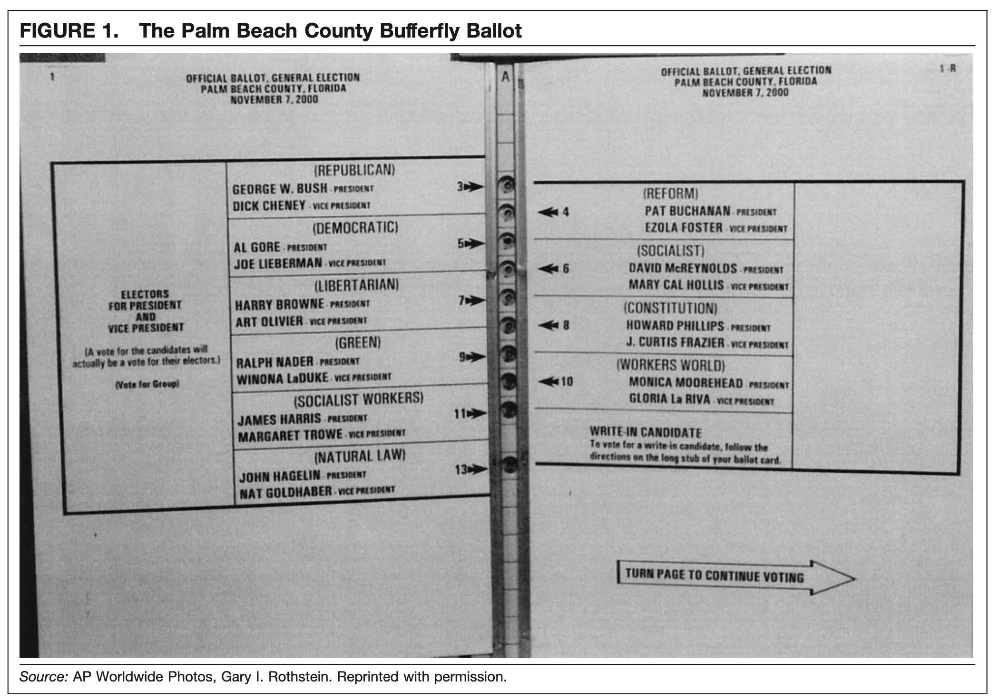

<div class="notes">
Documentation on using ioslides is available here:
http://rmarkdown.rstudio.com/ioslides_presentation_format.html
Some slides are adopted (or copied) from OpenIntro: https://www.openintro.org/
</div>

```{r setup, echo=FALSE, results='hide', warning=FALSE, message=FALSE}
set.seed(2112)
library(tidyverse)
library(ggplot2)
library(openintro)
library(DATA606)
library(reshape2)
library(psych)
library(reshape2)
options(width=100)
par(mar=c(2.5,1,2,1))

```

## Announcements

Data project proposals have been graded. If you didn't get 5/5 you can resubmit for full credit. Be sure to see my comments.

Data Science Institute at Columbia University we will host the third annual the third annual [Machine Learning in Science & Engineering](https://www.mlse2020.com) (MLSE 2020) conference virtually on December 14 - 15, 2020. It is free for students. [Click here for more information](https://urldefense.proofpoint.com/v2/url?u=https-3A__www.mlse2020.com_&d=DwMFaQ&c=mRWFL96tuqj9V0Jjj4h40ddo0XsmttALwKjAEOCyUjY&r=k-rrbmIjDXeAJ1scvTmL2Im7SFxIDSoGRIojDoHeXDg&m=5KPsFvVZdJpn0tLlHM3-CuY46UIp6gGqn5SP-cONFy0&s=FRzqxZe2u7fGAUVHVuIpSVvPhrwX4I9CyY9Mg190lyk&e=)

## Presentations

* 7.53 Mustafa Telab	
* Brett Davidoff	
* 8.21 - [Alexis Mekueko](https://rpubs.com/amekueko/684788)

## Data Project

[Click here](https://docs.google.com/spreadsheets/d/1LeIT87c7iTOGmJvZ4z8eyOOP530h3LLYBCJjxAxThLY/edit#gid=0) to sign-up for a presentation slots. There are two time slots (12 to 1:30pm and 8 to 9:30pm) on three different days (December 1st, 3rd, and 8th).

You are required to attend ONLY ONE of those time slots. You will do your presentation, watch the other presentations, and provide peer feedback (will be shared anonymously afterward).

Presentations should be **no more than 10 minutes.**

## Checklist / Suggested Outline {.smaller}

* Overview slide
	* Context on the data collection
	* Description of the dependent variable (what is being measured)
	* Description of the independent variable (what is being measured; include at least 2 variables)
	* Research question

* Summary statistics

* Include appropriate data visualizations.

* Statistical output
	* Include the appropriate statistics for your method used.
	* For null hypothesis tests (e.g. t-test, chi-squared, ANOVA, etc.), state the null and alternative hypotheses along with relevant statistic and p-value (and confidence interval if appropriate).
	* For regression models, include the regression output and interpret the R-squared value.

* Conclusion
	* Why is this analysis important?
	* Limitations of the analysis?


## Criteria for Grading

* Data is presented to support the conslusions using the appropriate analysis (i.e. the statistical method chosen supports the research question).

* Suitable tables summarize data in a clear and meaningful way even to those unfamiliar with the project.

* Suitable graphics summarize data in a clear and meaningful way even to those unfamiliar with the project.

* Data reviewed and analyzed accurately and coherently.

* Proper use of descriptive and/or inferential statistics.

# Example Project

## 2000 Election {.flexbox .vcenter}

The 2000 election between George Bush and Al Gore was ultimately decided in Florida. However, there was a third candidate on the ballot, Pat Buchanan, and one county with an unpredictable outcome. Is there evidence that a large number of votes were cast for a mistaken candidate?

The `elections` data frame contains the breakdown of votes by each of the 67 counties in Florida.

```{r}
elections <- read.table("../course_data/2000elections.txt", header=TRUE)
```

```{r, echo=FALSE}
source('../course_data/fl_counties.R')
elections$County_Name <- fl.counties
```

There are `r nrow(elections)` counties in Florida that cast at total of `r prettyNum(sum(elections$bush), big.mark = ',')` votes for George Bush and `r prettyNum(sum(elections$gore), ',')` resulting in Bush winning by `r sum(elections$bush) - sum(elections$gore)` votes.

However, in the days following the election there was much controversy surrounding so called "hanging chads." That is, there were a number of ballots where it was not clear who the vote was for. This was a particular issue in Palm Beach. 

##  {.flexbox .vcenter}

```{r, echo = FALSE, fig.width = 8, fig.height = 6}
# library(usmap)
# usmap::plot_usmap("counties", include = c("FL"))
# fl <- usmap::us_map(regions = "counties") %>% filter(abbr == 'FL')
# plot_usmap(regions = 'counties', include = 'FL')

library(urbnmapr)
elections <- elections %>% 
	mutate(difference = bush - gore,
		   percent_bush = bush / (bush + gore))
fl <- counties %>% filter(state_abbv == 'FL') %>%
	mutate(County_Name = toupper(gsub(' County', '', county_name))) %>%
	left_join(elections, by = 'County_Name')
palm_beach <- fl %>% filter(County_Name == 'PALM BEACH')
ggplot(fl, aes(long, lat, group = group, fill = percent_bush)) + 
	geom_polygon(color = "#ffffff", size = .25) +
	geom_polygon(data = palm_beach, color = 'black', size = 1) +
	scale_fill_gradient2(low = 'blue', high = 'red', mid = 'white', midpoint = 0.5) +
	coord_map() + theme_void() + theme(legend.position = 'none')
```

## Number of votes by county in Florida {.flexbox .vcenter}

```{r}
ggplot(elections, aes(bush, buch)) + geom_point() +
	xlab("Number of votes for Bush") + ylab("Number of votes for Buchanan") +
	ggtitle("Number of votes by county in Florida")
```

## Correlation

```{r}
cor.test(elections$buch, elections$bush)
```

## Linear Regression Model

```{r}
model1 <- lm(buch ~ bush, data = elections)
summary(model1)
```


## Residual Analysis {.flexbox .vcenter}

```{r, echo=FALSE, fig.height=5.5}
par.orig <- par(mfrow=c(2,2))
plot(log(elections$bush), resid(model1), main="Predictors vs Residuals")
abline(0,0)
plot(fitted(model1), resid(model1),main="Fitted vs Residuals", xlab="Fitted Values")
abline(0,0)
qqnorm(resid(model1), main="QQ-Plot of Residuals")
qqline(resid(model1))
hist(resid(model1), main="Histogram of Residuals")
par(par.orig)
```

## Log Tranform {.flexbox .vcenter}

```{r}
ggplot(elections, aes(bush, buch)) + geom_point() +
	scale_x_log10() + scale_y_log10() +
	xlab("Log of number of votes for Bush") + ylab("Log of number of votes for Buchanan") +
	ggtitle("Number of votes by county in Florida")
```

## Correlation with log tranformations
```{r}
cor.test(log(elections$buch), log(elections$bush))
```

## Linear Regression Model (log transform)

```{r}
model2 <- lm(log(buch) ~ log(bush), data = elections)
summary(model2)
```

## Regression model without Palm Beach

```{r}
model3 <- lm(log(buch) ~ log(bush), data = elections[-50,])
summary(model3)
```

## Residual Analysis (log) {.flexbox .vcenter}

```{r, echo=FALSE, fig.height=5.5}
par.orig <- par(mfrow=c(2,2))
plot(log(elections$bush[-50]), resid(model3), main="Predictors vs Residuals")
abline(0,0)
plot(fitted(model3), resid(model3), main="Fitted vs Residuals", xlab="Fitted Values")
abline(0,0)
qqnorm(resid(model3), main="QQ-Plot of Residuals")
qqline(resid(model3))
hist(resid(model3), main="Histogram of Residuals")
par(par.orig)
```

## Predict Palm Beach from the model

Obtain the predicted vote count for Palm Beach given the fitted model without

```{r}
new <- data.frame(bush = elections$bush[50])
```

The difference between predicted on the original scale and the observed vote count

```{r}
elections$buch[50] - exp(predict(model3, new))
```

## Predict Palm Beach from the model (cont.)

Prediction Confidence Interval for log(vote count)

```{r}
predict(model3, new, interval='prediction', level=.95)
```

Prediction Confidence Interval on the original scale

```{r}
exp(predict(model3, new, interval='prediction',level=.95))
elections$buch[50]
```

Therefore, what we can say is that it is likely that Palm Beach is a different community.


## {.centered}




## References

Wand, J.N., Shotts, K.W., Sekhon, J.S., Mebane, W.R., Herron, M.C., & Brady, H.E. (2001). [The Butterfly Did It: The Aberrant Vote for Buchanan in Palm Beach County, Florida](http://sekhon.berkeley.edu/papers/butterfly.pdf). *American Political Science Reviw, 95*(4).

Smith, R.L. (2002). [A Statistical Assessment of Buchanan’s Vote in Palm Beach County](https://projecteuclid.org/download/pdf_1/euclid.ss/1049993203). *Statistical Science, 17*(4).

[Regression Analysis - 1.3.3 - 2000 Elections in Florida (Youtube)](https://www.youtube.com/watch?v=C0NPK24YByM)
